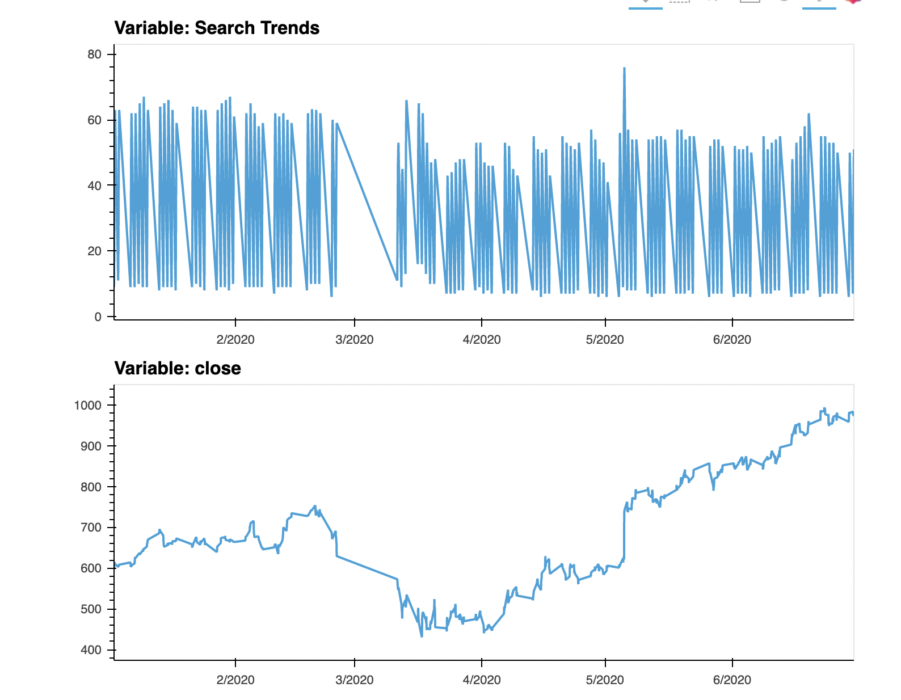

# forecasting_net_prophet

The **forecasting_net_prophet** analyzes the MercadoLibre company's financial and user data in clever ways to make the company grow, to find out if the ability to predict search traffic can translate into the ability to successfully trade the stock.

## Technologies

This project leverages python 3.7.13 with the following packages:

* [pandas](https://pandas.pydata.org/) - For data analysis
* [Prophet](https://pypi.org/project/fbprophet/) - For Automatic Forecasting Procedure
* [PyStan](https://pystan.readthedocs.io/en/latest/) - For statistical modeling and high-performance statistical computation. 


---

## Installation Guide

Before running the application first install the pandas dependency in conda dev environment.

```python

    conda create -n dev python=3.7 anaconda

    python -m ipykernel install --user --name dev
    conda install -c conda-forge nodejs

    conda activate dev

    conda install pystan=2.19.1.1

    conda install --yes -c conda-forge fbprophet

    jupyter lab

    conda deactivate 

  
```

---


## Usage

To use the **forecasting_net_prophet** simply clone the repository and run the **forecasting_net_prophet.ipynb** with jupyter lab:

```python
    conda activate dev

    jupyter lab

    conda deactivate 
```

The screenshot of, google_search_close_trend




The screenshot of, Predictions_for_the_Mercado_sales


The screenshot of, Prophet_predictions_for_the_Mercado_trends_data


---

## Contributors

Kausar Hina

---

## License

MIT

